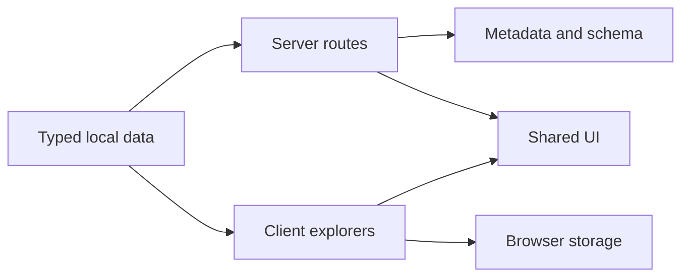

# Architecture

## Overview

The site uses Next.js App Router with Server Components by default. Client
Components are limited to interactive behavior: theme selection, navigation
drawer, animation, search/filter state, favorites, dialogs, toasts, pagination,
dashboard local state, and contact-form preparation.



## Key boundaries

| Boundary       | Current implementation                  | Future integration                           |
| -------------- | --------------------------------------- | -------------------------------------------- |
| Catalog data   | Typed repository arrays                 | CMS or API adapter                           |
| Favorites      | Versionless browser local storage       | Authenticated datastore                      |
| Contact        | User-reviewed `mailto:` handoff         | Validated server endpoint and email provider |
| Newsletter     | UI preview                              | Consent-aware email platform                 |
| Articles       | Typed manifest plus trusted MDX example | Build-time MDX manifest or reviewed CMS      |
| Research files | Static Markdown and CSV                 | Versioned document store                     |

## Components

- `Navbar`, `Footer`, and `SiteFrame` own global layout.
- `PageHero` provides consistent editorial hierarchy.
- `MotionReveal` centralizes restrained Framer Motion behavior.
- `ToolsExplorer`, `PromptLibrary`, and `BlogExplorer` own collection state.
- `Modal`, `Toast`, `Accordion`, `Pagination`, and `LoadingSkeleton` are shared
  accessible primitives.
- `SafetyNote` places privacy and clinical-use limits near relevant actions.

## State

The current browser-local keys are:

```text
dg-theme
dg-tool-favorites
dg-prompt-favorites
```

They contain preferences and content IDs only. No health, identity, or account
data should be stored.

## Content security

Repository MDX is executable JSX and therefore trusted code. Never compile
untrusted text directly as MDX. External content needs schema validation,
sanitization, and a component allowlist.

## Performance choices

- Server rendering for route shells and content-heavy pages
- No required raster hero image
- CSS gradients for atmosphere and brand art
- Client bundles isolated by feature
- No autoplay media
- Native lazy behavior available for future images
- Motion disabled for `prefers-reduced-motion`

## Future backend

Before adding accounts or persistence:

1. Define the identity provider and access model.
2. Version stored records and local-to-cloud migration.
3. Add server-side validation, rate limits, bot protection, and audit logging.
4. Complete a privacy, security, healthcare-governance, and data-retention
   review.
5. Keep protected health information outside the product unless an approved,
   purpose-built compliance architecture exists.
