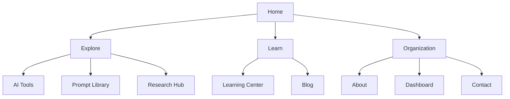

# Product Blueprint

## Product intent

Digital GiGz AI Lab helps nurses, educators, students, researchers, and
healthcare teams build practical AI capability without separating utility from
responsibility.

The product must answer four questions quickly:

1. What can I learn here?
2. What can I use right now?
3. What must I verify or avoid?
4. Where can I continue my work?

## Audience needs

| Audience                            | Primary need                          | Product response                                   |
| ----------------------------------- | ------------------------------------- | -------------------------------------------------- |
| Nurses and healthcare professionals | Clear, relevant starting points       | Guided tools, prompts, short learning              |
| Nurse educators                     | Teach AI literacy responsibly         | Lesson pathways, synthetic-case prompts            |
| Nursing students                    | Build judgment without overconfidence | Study prompts, source checks, explicit limits      |
| Researchers                         | Keep questions and evidence traceable | PICOT, search, appraisal, and audit templates      |
| Administrators                      | Frame adoption decisions              | Implementation brief, risk and stakeholder prompts |

## Information architecture

## Primary route wireframes

### Landing

1. Fixed glass navigation
2. Hero with positioning, trust cues, and two actions
3. Honest inventory statistics
4. Mission and four product pillars
5. Responsible-use principles
6. Illustrative testimonial previews
7. Collaboration audiences
8. Newsletter preview
9. Footer and educational disclaimer

### Catalogs

1. Context-rich page hero
2. Privacy/safety note beside the workflow
3. Sticky search and category controls
4. Responsive card grid
5. Favorite/bookmark action
6. Detail dialog or copy action
7. Accessible empty state

### Dashboard

1. Workspace navigation sidebar
2. Contextual greeting and quick action
3. Local saved-item metrics
4. Continue-learning widget
5. Quick actions
6. Bookmarks and featured prompts
7. Recent articles

## Content model

Core content types are defined centrally:

- `LabTool`
- `PromptItem`
- `BlogPost`
- research-resource records
- learning-path records

UI components consume these types so future CMS, API, or database integration
can replace local data without rewriting page structure.

## Product principles

- Human judgment first
- Privacy by design
- Evidence over confidence
- Limits made visible
- Learning through iteration
- Inclusive and accessible by default

## Delivery phases

### Phase 1 — Planning

- Product intent and audience needs
- Information architecture
- Route wireframes
- Folder model
- Brand and content standards

### Phase 2 — Frontend

- Reusable layout and UI components
- Complete public routes
- Search, filters, favorites, modal, toast, accordion, pagination
- Dashboard and contact behavior

### Phase 3 — Optimization

- Server-first rendering
- Narrow client boundaries
- Route metadata and structured data
- Keyboard, reduced-motion, contrast, reflow, and focus handling
- Honest privacy and healthcare safety language

### Phase 4 — Repository readiness

- Installation and architecture documentation
- Deployment instructions
- Contribution, conduct, security, changelog, and license
- Locked dependencies and reproducible scripts
